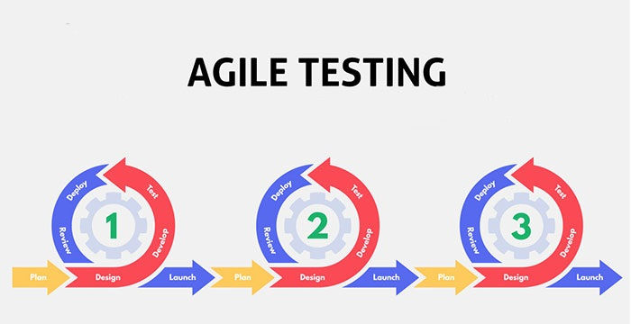

# Agile Testing Practices 

## Introduction
In the last part of this handbook, we will be discussing Agile Testing and we’ll mention some good agile testing practices that we expect all current and future employees to follow. Firstly, we will discuss what agile testing is and why it is important. Agile testing is a methodology that helps developers test their code continuously and rapidly and in agile testing, there are various roles and responsibilities of different team members. The main principles include: early and continuous testing, whole team approach, frequent deliveries, close collaboration, customer involvement, working software and flexible approach. All this is important because it helps to ensure that software meets the needs of the customer (n.d).
Through research we have the best practices for agile testing.

  

## Common Themes

•	Exploratory Testing                                                

•	Continuous Integration and Continuous Deployment (CI/CD)

•	Behavior-Driven Development (BDD)

## Exploratory Testing

Using a strategy that emphasizes learning, adaption, and exploration, exploratory testers simultaneously develop and run test cases. 

### Challenges

## Continuous Integration and Continuous Deployment (CI/CD)

The techniques of continuous deployment (CD) and continuous integration (CI) make guarantee that code updates are automatically tested, built, and put into production settings.

### Challenges

## Behavior-Driven Development (BDD)

A cooperative method of developing software, behavior-driven development (BDD) promotes dialogue among developers, quality assurance (QA), and business stakeholders.

### Challenges

## Personal Experiences
#### Resistance to Change
Agile testing frequently faces resistance since it can be difficult to break old habits and viewpoints. We have an individual, based on first-hand experience and narrative, who during a pivotal moment in their career occurred when they managed an engineering team that resisted automated testing, perceiving it as solely within the domain of QA. However, after insisting on its implementation and facing initial pushback, a notable transformation ensued. Not only did code quality improve, but even the most steadfast opponent of automated testing became its most fervent advocate in the face of failing tests. This experience highlighted the transformative power of embracing change and establishing new patterns. Despite the challenges of transition, the long-term benefits in efficiency and quality far outweighed the initial discomfort, prompting reflection on why such practices weren't adopted sooner.

## References:

https://www.atlassian.com/agile/software-development/testing

https://www.opentext.com/what-is/agile-testing

https://www.kualitee.com/blog/agile-testing/qa-process-in-agile/

