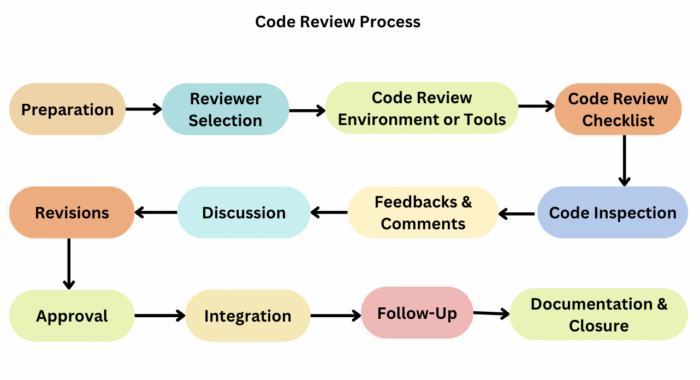

# Code Reviews

## Introduction
In the Second  part of this handbook, we will be discussing Code Reviews and we’ll mention some good code review  practices that we expect all current and future employees to follow. Firstly, we will discuss what code reviews is and why it is important.Code reviews are an essential aspect of the software development lifecycle. It involves the examination of a programmer’s code by their peers to identify and rectify errors, improve code quality and ensure compliance with coding standards. This process helps maintain code integrity and leads to the creation of robust, reliable and efficient software. Code reviewing is important because  developers scrutinise each other’s code, looking for potential bugs, performance issues and adherence to best practices. This collaborative approach encourages knowledge sharing and helps maintain a high level of code quality throughout the project.

  

## Common Themes

•	Following Coding Standards         

•	Scheduling and Allocating Time

•	Setting Clear Objectives

•	Documentation quality

•	Communication

## Following Coding Standards 

The code standards and best practices for the project or team are established and documented, ensuring universal awareness. Tools like code linters, style guides, or checklists are utilized to enforce and verify these standards. Additionally, code is reviewed against these standards, with any deviations or violations identified and suggestions provided for improvement or rectification according to the established criteria. Tools such as code analyzers, code formatters, or code quality metrics are employed to aid in this process.

### Challenges

•	 A challenge in code review is how to ensure that the code follows consistent standards and best practices, such as coding style, naming conventions, documentation, testing, and security. 

•	 Code reviews may result in disagreements or conflicts since various developers may have different preferences for coding styles and methodologies.
 

## Scheduling and Allocating Time

Code review tasks are prioritized and planned, with more time and attention allocated to important, urgent, or risky changes. Tools such as code review platforms, issue trackers, or project management tools are utilized for organization and tracking purposes. Additionally, developers are encouraged to submit small, incremental, and well-defined code changes rather than large, monolithic ones.

### Challenges

•	 As developers must examine and comment on each other's work, code reviews can take a lot of time. For companies with little funding or short lead times, this might be particularly difficult.

•	 A code review might not be able to find every bug in the code or cover every facet of it. This implies that certain problems would not become apparent until much later in the development process, which could result in the need to invest more time and money in their resolution.

## Communication

Respect and constructive criticism serve as the cornerstone of any code review, thus it's important to refrain from personal attacks, sarcasm, or harsh criticism. Moreover, feedback and suggestions should be as specific and clear as possible, with reasoning explained and examples or references provided if feasible.

### Challenges

•	One of the main challenges in code review is how to communicate effectively with the developers, especially when giving feedback or suggesting changes. Poor communication can lead to misunderstandings, conflicts, or demotivation, so to ensure successful communication, you should adhere to some basic principles.

•	 As code reviews are frequently conducted remotely and may involve several reviewers offering feedback on the same code, they might be prone to misunderstandings.

## Personal Experiences
#### Lack of Documentation
The most common issue I have seen is lack of documentation and comments with the code. Each developer has their own way of implementing the logic and lack of docs & comments lead to confusion for the reviewer if they had a different implementation in mind.  And hence both reviewer and developer has to put in more effort and time to clear out the doubts and confusion. There are a lot of AI tools available today that would generate documentation based on your code which we can use in day to day life to mitigate this problem.

#### Setting Clear Objectives
Unrealistic or poorly specified requirements are a major contributor to software errors and problems. Your program will not live up to expectations or address problems if you don't know what it should do, how it should act, and what the users need and want. As a result, you should take the time and make the effort to clearly define requirements that are reasonable and in line with the restrictions, goals, and scope of the project. Along with involving users and stakeholders in the requirements elicitation and validation process, you need also successfully capture and express the requirements through the use of techniques like user stories, use cases, scenarios, and prototyping.

## References:
Khrupa, A. (2022, June 30). What Is Code Review in Software Testing. Retrieved from Testfort Website: https://testfort.com/blog/what-is-code-review-in-software-testing

Swimm Team. (2024). Code reviews: pros and cons, approaches, tools and tips. Retrieved from Swimm Website: https://swimm.io/learn/code-reviews/code-reviews-pros-and-cons-approaches-tools-and-tips

Tuama, D. Ó. (2024). The Importance of Code Reviews. Retrieved from Code Institute Wesite: https://codeinstitute.net/ie/blog/the-importance-of-code-reviews/?utm_term=&utm_campaign=CI+-+IRL+-+Search+-+NB&utm_source=adwords&utm_medium=ppc&hsa_acc=8983321581&hsa_cam=14237255693&hsa_grp=137795022472&hsa_ad=636590391770&hsa_src=g&hsa_tgt=aud-3155759

W., F., Y. , M., & B., Z. (2024). What are the most common challenges in code review and how can you overcome them? Retrieved from LinkedIn Website: https://www.linkedin.com/advice/3/what-most-common-challenges-code-review-how-can-uomrc

LinkedIn. (2024). What are the most cost-effective ways to ensure software quality assurance? Retrieved from LinkedIn Website: https://www.linkedin.com/advice/3/what-most-cost-effective-ways-ensure-software-mwzef?lipi=urn%3Ali%3Apage%3Ad_flagship3_search_srp_content%3BeedUeNoBR6Csi%2BAxRuZ76g%3D%3D

