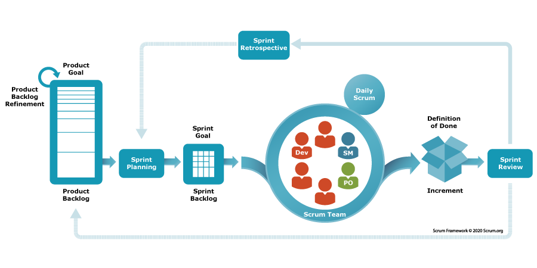

# Task Estimation Scrum

## Introduction
In the First  part of this handbook, we will be discussing Task Estimation Scrum and we’ll mention some good Task Estimation Scrum  practices that we expect all current and future employees to follow. Firstly, we will discuss what Task Estimation Scrum is and why it is important.Scrum as a way to get work done as a team in small pieces at a time, with continuous experimentation and feedback loops along the way to learn and improve as you go. Scrum helps people and teams deliver value incrementally in a collaborative way. As an agile framework, Scrum provides just enough structure for people and teams to integrate into how they work, while adding the right practices to optimize for their specific needs. 

  

## Common Themes

•	Relative Estimates (Story Point Estimates)

•	Calibration and Refinement

•   Estimation Criteria

•   Avoiding Obsession with Exact Estimates

## Relative Estimates (Story Point Estimates) 
Relative Story Point Estimation uses a “unit-less number” to estimate user stories by grouping requirements based on equivalent difficulty. In simple terms, it is a way of sizing user stories relative to each other.

### Challenges 
Challenge: Achieving a common understanding among team members about the size and complexity of work items can be quite intricate.
Explanation: When estimating tasks, team members must align their mental models. However, different perspectives, experiences, and interpretations can lead to discrepancies. For instance, one developer might perceive a user story as straightforward, while another might see hidden complexities.
Impact: Without shared understanding, the team may underestimate or overestimate tasks, leading to planning inaccuracies and potential delays.

## Calibration and Refinement
Solution testing and refinement is a crucial stage in the innovation process, where you validate and improve your ideas based on feedback, data, and experimentation.

### Challenges
•  Regularly calibrating estimation practices and refining them can be time-consuming and resource-intensive.
Explanation: Teams need to periodically review their estimation techniques, adjust them based on historical data, and ensure consistency across Sprints. Calibration involves fine-tuning the team’s estimation process to account for changes in team dynamics, technology, and domain knowledge.
Impact: Inaccurate estimations due to lack of calibration can lead to missed deadlines or inefficient resource allocation.

## Estimation Criteria
Criteria that help project managers estimate the size, effort, duration, cost, or value of a project or its components. Estimation metrics can be based on historical data, expert judgment, analogy, or algorithm.

### Challenges
•  Defining clear and consistent criteria for estimation can be challenging.
Explanation: Teams must decide whether to estimate based on effort (e.g., hours, days), complexity (e.g., Fibonacci sequence), or other factors (e.g., story points). Choosing the right criteria impacts the accuracy of estimates.
Impact: Inconsistent criteria can lead to confusion, making it difficult to compare estimates across different tasks.

## Avoiding Obsession with Exact Estimates
Instead of fixating on pinpoint accuracy, focus on providing realistic and flexible estimates that allow for adaptation to changing requirements and unforeseen challenges. Emphasize communication, collaboration, and iterative improvement to navigate uncertainties effectively and deliver successful outcomes.
### Challenges

•  Striking a balance between predictability and adaptability is crucial.
Explanation: While estimates are essential for planning and creating a predictable cadence, teams should avoid fixating on exact numbers. Agile principles emphasize adaptability, and rigid adherence to precise estimates can hinder flexibility.
Impact: Focusing too much on precision may lead to unnecessary stress, micromanagement, and missed opportunities for innovation.

## Personal Experiences
Estimation in Scrum isn’t a straightforward science, it’s more of an art. It involves making educated guesses, setting targeted Sprint goals, and staying flexible. As we navigate this labyrinth, we encounter the unpredictability of creative work. While some tasks are predictable, each product development journey remains unique. Estimation isn’t just about numbers, it’s about grasping the unknowns and being prepared for twists and turns.

The key takeaways are:
Scrum Team’s Estimation Challenge: Acknowledge that estimation isn’t a one-size-fits-all process. Different teams may approach it differently, and that’s okay.

Sizing vs. Estimation: Understand the distinction between sizing (assessing the relative effort) and traditional estimation (assigning specific numbers). Scrum leans more toward sizing.
Embrace Unpredictability: Creative work can’t always be neatly quantified. Be ready for surprises and adapt as needed.

Realistic Sprint Planning: Set realistic goals for each Sprint. Flexibility and adaptability are your allies.

Remember, in Scrum, it’s not about reaching a precise destination, it’s about navigating the journey with agility and adaptability. If you find Sprint estimation challenging, seek guidance and stay open to learning. You don’t just need agility, you need Naked Agility

## References:
What Scrum says about estimates. (2024). Retrieved from https://www.scrum.org/resources/blog/what-scrum-says-about-estimates 

How do scrum teams estimate tasks in a project? (2024). Retrieved from https://blog.scrumstudy.com/how-do-scrum-teams-estimate-tasks-in-a-project/ 

Articles. (2024). Retrieved from https://www.scrumstudy.com/article/task-estimation-in-a-scrum-project 

When will we get there?  how to estimate in Scrum. (n.d.-b). Retrieved from https://www.scrum.org/resources/blog/when-will-we-get-there-how-estimate-scrum 

Project Management . (2024). How do you select estimation metrics for various project types? Retrieved from https://www.linkedin.com/advice/1/how-do-you-select-estimation-metrics-various-ufrdf 

Hishelwood, M. (2023). Sprint estimation: A guide to planning in Scrum. Retrieved from https://www.scrum.org/resources/blog/sprint-estimation-guide-planning-scrum 